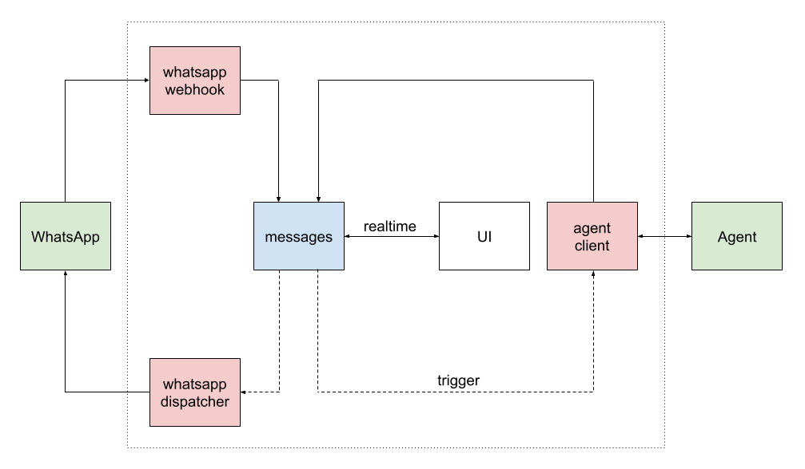

# Open BSP API

The Open Business Service Provider API integrates with the **WhatsApp Business Platform**. It is built with Deno 🦕, powered by Postgres 🐘 and runs on Supabase ⚡ for scalable, modern backend infrastructure.

Open BSP is designed for both individual businesses and service providers. You can use it to manage your own WhatsApp messaging, or leverage its features to become a [Meta Business Partner](https://developers.facebook.com/docs/whatsapp/solution-providers) and offer WhatsApp messaging services to other organizations.

> **Sign up for a free account (requires a Google account) and try it out at [web.openbsp.dev](https://web.openbsp.dev)**!

🚀 **Powering production-grade AI agents at [Mirlo.com](https://mirlo.com/agentes-ia/whatsapp)**

## User Interface

For a complete web-based interface to manage conversations check out the companion project:

**🖥️ [Open BSP UI](https://github.com/matiasbattocchia/open-bsp-ui)** — A modern, responsive web interface built with React and Tailwind.

<p align="center">
  
</p>

## Description

Open BSP API is a multi-tenant platform that connects to the official WhatsApp API to receive and send messages, storing them in a Supabase-backed database.

### Core features

- 🤝 **Meta Business Partner ready**: Built to facilitate the transition to an official solution provider.
- 🔗 **WhatsApp account Coexistence**: Connect existing WhatsApp Business accounts via [Embedded Signup](https://developers.facebook.com/documentation/business-messaging/whatsapp/embedded-signup/onboarding-business-app-users).
- 🏢 **Multi-tenant architecture**: Native support for multiple organizations with isolated environments.
- 🔌 **External integration**: Seamlessly connect with external services using webhooks and the API.

### AI agents

Create lightweight agents or connect to external, more advanced agents using different protocols like `a2a` and `chat-completions`. Lightweight agents can use built-in tools:

- MCP client
- SQL client
- HTTP client
- Calculator
- Transfer to human agent
- Attach file

> [!IMPORTANT]
> This project prioritizes a decoupled architecture between communication and agent logic. Advanced agents built with frameworks like the OpenAI SDK or Google ADK should be deployed as external services.

### Media processing

Interpret and extract information from media and document files, including:

- Audio
- Images
- Video
- PDF
- Other text-based documents (CSV, HTML, TXT, etc.)

### MCP server

The `mcp` Edge Function exposes an [MCP](https://modelcontextprotocol.io) server over SSE, giving agentic access to the WhatsApp API from clients like Claude Desktop or other agent platforms.

Authentication uses the `Authorization: Bearer <API_KEY>` header. Optionally, `Allowed-Contacts` and `Allowed-Accounts` headers restrict which phone numbers the key can access.

Available tools:

| Tool | Description |
|------|-------------|
| `list_accounts` | List connected WhatsApp accounts |
| `list_conversations` | Get recent active conversations |
| `fetch_conversation` | Fetch messages and service window status for a contact |
| `search_contacts` | Find contacts by name or phone number |
| `send_message` | Send a text or template message (enforces 24h service window) |
| `list_templates` | List available WhatsApp templates |
| `fetch_template` | Fetch details of a specific template |

## Deployment

> [!NOTE]
> No local environment is required to deploy this project. This is a close approach to a one-click deploy to Supabase.

1. Create a [Supabase](https://supabase.com) project (5 min)
2. [Fork me](https://github.com/matiasbattocchia/open-bsp-api/fork) from the `main` branch (1 min)
3. Configure the following secrets and variables for GitHub Actions in your repository settings (7 min)
4. Re-run the _Release_ action (1 min)

You are live! 🚀

#### Secrets

> [!TIP]
> Create the secrets at GitHub > Repository > Settings ⚙️ > Secrets and variables \*️⃣ > Actions > Secrets <!-- `https://github.com/{github_account}/open-bsp-api/settings/secrets/actions` -->

- **SUPABASE_ACCESS_TOKEN**: A
  [personal access token](https://supabase.com/dashboard/account/tokens)
- **SUPABASE_DB_PASSWORD** <!-- Get it at Supabase > Project > Database > Settings > Database password `https://supabase.com/dashboard/project/{project_id}/database/settings` -->
- **SUPABASE_SERVICE_ROLE_KEY**: you can use a secret key instead of the legacy service role key <!-- Get it at Supabase > Project > Project Settings > API keys > API Keys > Secret keys `https://supabase.com/dashboard/project/{project_id}/settings/api-keys/new` -->

#### Variables

> [!TIP]
> Create the variables at GitHub > Repository > Settings ⚙️ > Secrets and variables \*️⃣ > Actions > Variables <!-- `https://github.com/{github_account}/open-bsp-api/settings/variables/actions` -->

- **SUPABASE_PROJECT_ID** <!-- the `{project_id}` in `https://supabase.com/dashboard/project/{project_id}` -->
- **SUPABASE_SESSION_POOLER_HOST**: it is like `aws-0-us-east-1.pooler.supabase.com` <!-- Found at Supabase > Project > Connect 🔌 > Session pooler > View parameters > Host `https://supabase.com/dashboard/project/{project_id}/database/schemas?showConnect=true` -->

#### Release

> [!TIP]
> Go to GitHub > Repository > Actions ▶️ > Release <!-- `https://github.com/{github_account}/open-bsp-api/actions/workflows/release.yml` -->

1. Click **Run workflow**

## WhatsApp Integration

To connect your OpenBSP project to the WhatsApp API, you'll need to setup a Meta App with the WhatsApp product and configure the following Edge Functions secrets. You can set these up in two ways:

- **Direct configuration**: Add them directly in your Supabase dashboard at Supabase > Project > Edge Functions > Secrets. <!-- `https://supabase.com/dashboard/project/{project_id}/functions/secrets` -->
- **GitHub Actions**: Set them as GitHub Actions secrets in your repository settings and re-run the _Release_ action to automatically deploy them.

#### Secrets

- **META_SYSTEM_USER_ID**
- **META_SYSTEM_USER_ACCESS_TOKEN**
- **META_APP_ID**
- **META_APP_SECRET**
- **WHATSAPP_VERIFY_TOKEN**

Follow these steps to obtain the required credentials.

<details>
<summary>
Step 0: Overview
</summary>

There is quiet a Meta nomenclature of entities that you might want to get in order to not to get lost in the platform.

- **Business profile** - This is the top-level entity, represents a business. Has users and assets.
- **User** - Real or system users. System users can have access tokens. Users belong to a business portfolio and can have assigned assets.
- **Asset** - WhatsApp accounts, Instagram accounts, Meta apps, among others. Assets belong to a business portfolio and are assigned to users.
- **App** - An asset that integrates Meta products such as the WhatsApp Cloud API.
- **WhatsApp Business Account (WABA)** - A WhatsApp account asset, can have many phone numbers.
- **Phone number** - A registered phone number within the WhatsApp Cloud API. Belongs to a WABA.

> For more details, refer to [Cloud API overview](https://developers.facebook.com/docs/whatsapp/cloud-api/overview).
</details>

<details>
<summary>
Step 1: Create a Meta app (skip if you already have one)
</summary>

1. Navigate to [My Apps](https://developers.facebook.com/apps)
2. Click **Create App**
3. Select the following options:
   - **Use case**: Other
   - **App type**: Business
4. Add the **WhatsApp** product to your app
5. Click **Add API**
6. Disregard the screen that appears next and proceed to the next step
</details>

<details>
<summary>
Step 2: Create a system user
</summary>

1. Get into the [Meta Business Suite](https://business.facebook.com). If you have multiple portfolios, select the one associated with your app
2. Go to Settings > Users > System users <!-- `https://business.facebook.com/latest/settings/system_users` -->
3. Add an **admin system user**
4. Copy the **ID** → **META_SYSTEM_USER_ID**
5. Assign your app to the user with **full control** permissions
6. Generate a token with these permissions:
   - `business_management`
   - `whatsapp_business_messaging`
   - `whatsapp_business_management`
7. Copy the **Access Token** → **META_SYSTEM_USER_ACCESS_TOKEN**

> For detailed instructions on system user setup, refer to the
> [WhatsApp Business Management API documentation](https://developers.facebook.com/docs/whatsapp/business-management-api/get-started).
</details>

<details>
<summary>
Step 3: Get the app credentials
</summary>

1. Navigate to [My Apps](`https://developers.facebook.com/apps`) > App Dashboard <!-- `https://developers.facebook.com/apps/{app_id}` -->
2. Go to App settings > Basic <!-- `https://developers.facebook.com/apps/{app_id}/settings/basic` -->
3. Copy the following values:
   - **App ID** → **META_APP_ID**
   - **App secret** → **META_APP_SECRET**

> Multiple Meta apps are supported by separating values with `|` (pipe) characters. For example: `META_APP_ID=app_id_1|app_id_2` and `META_APP_SECRET=app_secret_1|app_secret_2`.
</details>

<details>
<summary>
Step 4: Configure the WhatsApp Business Account webhook
</summary>

### Part A

1. Within the App Dashboard
2. Go to WhatsApp > Configuration <!-- `https://developers.facebook.com/apps/{app_id}/whatsapp-business/wa-settings` -->
3. Set the **Callback URL** to: `https://{SUPABASE_PROJECT_ID}.supabase.co/functions/v1/whatsapp-webhook`
4. Choose a secure token for **WHATSAPP_VERIFY_TOKEN** → Set it as the **Verify token**, but **do not** click **Verify and save** yet!
5. Ensure your Edge Functions environment variables are up-to-date
   - If you configured secrets directly in your Supabase dashboard, no further action is needed at this point
   - If you set secrets via GitHub Actions, re-run the _Release_ action now to deploy them to your Edge Functions
6. Click **Verify and save**
7. Disregard the screen that appears next and proceed to the next step

> Multiple Meta apps are supported by appending the query param `?app_id={META_APP_ID}` to the callback URL. For example: `https://{SUPABASE_PROJECT_ID}.supabase.co/functions/v1/whatsapp-webhook?app_id=app_id_2`.

### Part B

1. Within the App Dashboard
2. Go to WhatsApp > Configuration <!-- `https://developers.facebook.com/apps/{app_id}/whatsapp-business/wa-settings` -->
3. Subscribe to the following **Webhook fields**:
   - `account_update`
   - `messages`
   - `history`
   - `smb_app_state_sync`
   - `smb_message_echoes`

> Optionally, test the configuration so far. In the `messages` subscription
section, click **Test**. You should see the request in Supabase > Project > Edge Functions > Functions > whatsapp-webhook > Logs. <!-- `https://supabase.com/dashboard/project/{project_id}/functions/whatsapp-webhook/logs` -->
>
> You might observe an error in the logs. This is an expected outcome at this stage; the simple fact that a log entry appears confirms that the webhook is successfully receiving events.
</details>

<details>
<summary>
Step 5: Add a phone number
</summary>

If you decide to add the **test number**,

1. Within the App Dashboard
2. Go to WhatsApp > API Setup <!-- `https://developers.facebook.com/apps/{app_id}/whatsapp-business/wa-dev-console` -->
3. Click **Generate access token** (you can't use the one you got from step 2 here)
4. Copy these values:
   - **Phone number ID**
   - **WhatsApp Business Account ID**
5. Select a recipient phone number
6. Send messages with the API > **Send message**

> The test number doesn't seem to fully activate to receive messages unless you send a test message at least once.

In order to add a **production number**,

1. Click **Add phone number**
2. Follow the flow
3. Navigate to [WhatsApp Manager](https://business.facebook.com/latest/whatsapp_manager/overview)
4. Go to Account tools > Phone numbers <!-- `https://business.facebook.com/latest/whatsapp_manager/phone_numbers` -->
5. Copy these values:
   - **Phone number ID**
   - **WhatsApp Business Account ID**

### For any number you add

Create an organization if you haven't done that already.

```sql
insert into public.organizations (name, extra) values
  ('Default', '{ "response_delay_seconds": 0 }')
;
```

Note the **organization ID**.

Register the phone number with your organization in the system.

```sql
insert into public.organizations_addresses (address, organization_id, service, extra) values
  ('<Phone number ID>', '<Organization ID>', 'whatsapp', '{ "waba_id": "<WhatsApp Business Account ID>", "phone_number": "<Phone number>" }')
;
```
</details>

## Architecture



In the image, green boxes are external services, red are Edge Functions and
blue, database tables. White boxes, clients, connect to the API via one of the
Supabase
[client libraries](https://supabase.com/docs/guides/api/rest/client-libs).

The system uses a reactive, function-based architecture:

1. A request from the WhatsApp API is received by the `whatsapp-webhook` function.
2. `whatsapp-webhook` processes the incoming message and stores it in the `messages` table.
3. An insert trigger on the `messages` table forwards the message to the `agent-client` function (incoming trigger).
4. `agent-client` builds the conversation context and sends a request to an agent API using the [Chat Completions](https://platform.openai.com/docs/api-reference/chat) format.
5. `agent-client` waits for the agent's response and saves it back to the `messages` table.
6. An outgoing trigger on the `messages` table forwards the new message to the `whatsapp-dispatcher` function.
7. `whatsapp-dispatcher` processes the message and sends a request to the WhatsApp API to deliver it.

This event-driven flow ensures that each component is decoupled and scalable.

### Edge Functions

#### WhatsApp

- `whatsapp-webhook`: Handles incoming webhook events from the [WhatsApp Cloud API](https://developers.facebook.com/docs/whatsapp/cloud-api).
- `whatsapp-dispatcher`: Sends outbound messages to the WhatsApp Cloud API.
- `whatsapp-manager`: Integrates with the [WhatsApp Business Management API](https://developers.facebook.com/docs/whatsapp/business-management-api) for business and phone number management.

#### Agent

- `agent-client`: Orchestrates agent interactions, builds conversation context, and communicates with external agent APIs.

### Database models

- **users**: Registered user in the application.
- **organizations**: Tenant entity; holds organization metadata.
- **organizations_addresses**: Organization's addresses per service; belongs to an `organization`.
- **contacts**: People associated with an `organization` (address book).
- **conversations**: Conversation between an organization_address and a contact_address for a service; belongs to an `organization`, optionally to a `contact`.
- **messages**: Messages within a `conversation` context; carries direction, type, payload, status, and timestamps.
- **agents**: Human or AI agents for an `organization`; optionally linked to an auth `user`.
- **api_keys**: API access keys scoped to an `organization`.
- **webhooks**: Outbound webhook subscriptions per `organization`.

## Configuration

### Organizations

```ts
export type OrganizationExtra = {
   response_delay_seconds?: number; // default: 3
   welcome_message?: string;
   authorized_contacts_only?: boolean;
   default_agent_id?: string;
   media_preprocessing?: {
      mode?: "active" | "inactive";
      model?: "gemini-2.5-pro" | "gemini-2.5-flash"; // default: gemini-2.5-flash
      api_key: string; // default GOOGLE_API_KEY env var
      language?: string;
      extra_prompt?: string;
   };
   error_messages_direction?: "internal" | "outgoing";
};
```

### Agents

The spirit of this project has been to equiparate the experience of human and AI agents.

#### Human

Roles and privileges

* Owner — full control: manage organizations, manage integrations, invite/remove anyone
* Admin — operational control: manage conversations, create AI agents
* Member — standard usage: create conversations, use the chat features

#### AI

```ts
export type AgentExtra = {
   mode?: "active" | "draft" | "inactive";
   description?: string;
   api_url?: "openai" | "anthropic" | "google" | "groq" | string; // default: openai
   api_key?: string; // default: provider env var, i.e. OPENAI_API_KEY
   model?: string; // default: gpt-5.2-chat-latest
   // TODO: Add responses (openai), messages (anthropic), generate-content (gemini).
   protocol?: "chat_completions" | "a2a"; // default: chat_completions
   assistant_id?: string;
   max_messages?: number;
   temperature?: number;
   max_tokens?: number;
   thinking?: "minimal" | "low" | "medium" | "high";
   instructions?: string;
   send_inline_files_up_to_size_mb?: number;
   tools?: ToolConfig[];
};
```

## Local development

Requires Node 🐢 and Docker 🐋.

### Database

```
npx supabase start
```

After editing the schema files, generate a migration

```
npx supabase db diff -f <migration_name>
```

Apply the migration to the local database

```
npx supabase migration up
```

Finally, update the types

```
npx supabase gen types typescript --local > supabase/functions/_shared/db_types.ts
```

### Edge Functions

```
npx supabase functions serve
```

## Roadmap

The roadmap includes support for new protocols:

- `responses` (OpenAI)
- `messages` (Anthropic)
- `generation` (Google)

Two more tools:

- Calendar (date calculator)
- Code execution (E2B)

An improved media preprocessor (more/different providers por document type) and more
types:

- DOC
- XLS