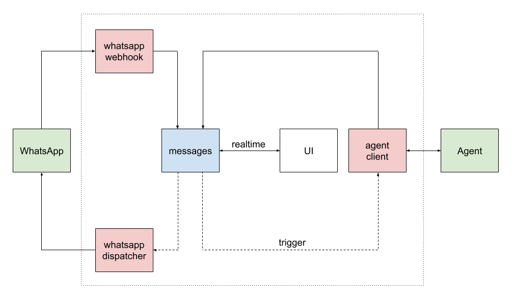

<h1 align="center">wakit API</h1>
<p align="center">
  <strong>Open-source WhatsApp Business Platform</strong>
</p>
<p align="center">
  Self-hostable, multi-tenant, AI-agent ready. Built with Deno 🦕 and Postgres 🐘, powered by Supabase ⚡
</p>

<p align="center">
  <a href="https://app.wakit.ai"></a>&nbsp;
  <a href="https://unlicense.org/"></a>&nbsp;
  <a href="https://github.com/matiasbattocchia/wakit-api/stargazers"></a>&nbsp;
  <a href="https://github.com/matiasbattocchia/wakit-api/commits/main"></a>&nbsp;
  <a href="https://chat.whatsapp.com/Ch6AwZizSDt5quzHodcYh5"></a>
</p>

wakit is designed for both individual businesses and service providers. You can use it to manage your own WhatsApp messaging, or leverage its features to become a [Meta Business Partner](https://developers.facebook.com/docs/whatsapp/solution-providers) and offer WhatsApp messaging services to other organizations.

🚀 **Powering production-grade AI agents at [Mirlo.com](https://mirlo.com/agentes-ia/whatsapp)**

> [!NOTE]
> This project is now backed by <a href="https://mirlo.com">Mirlo.com</a>, where I work, and is undergoing a rebranding. The project name is changing from **OpenBSP** to **wakit**.

## User Interface

For a complete web-based interface to manage conversations check out the companion project:

**🖥️ [wakit UI](https://github.com/matiasbattocchia/wakit-ui)** — A modern, responsive web interface built with React and Tailwind.

https://github.com/user-attachments/assets/1ef30dde-9de1-4f5a-856a-db34ca2e3063

## Description

wakit API is a multi-tenant platform that connects to the official WhatsApp API to receive and send messages, storing them in a Supabase-backed database.

### Core features

- 🤝 **Meta Business Partner ready**: Built to facilitate the transition to an official solution provider.
- 🔗 **WhatsApp account Coexistence**: Connect existing WhatsApp Business accounts via [Embedded Signup](https://developers.facebook.com/documentation/business-messaging/whatsapp/embedded-signup/onboarding-business-app-users).
- 🏢 **Multi-tenant architecture**: Native support for multiple organizations with isolated environments.
- 🔌 **External integration**: Seamlessly connect with external services using webhooks and the API.

### AI agents

Create lightweight agents or connect to external, more advanced agents using different protocols like `a2a` and `chat-completions`. Lightweight agents can use built-in tools:

- MCP client
- SQL client
- HTTP client
- Calculator

> [!IMPORTANT]
> This project prioritizes a decoupled architecture between communication and agent logic. Advanced agents built with frameworks like the OpenAI SDK or Google ADK should be deployed as external services.

### Media processing

Interpret and extract information from media and document files, including:

- Audio
- Images
- Video
- PDF
- Other text-based documents (CSV, HTML, TXT, etc.)

### Claude Code plugin

The wakit plugin gives Claude Code full API access and optionally bridges WhatsApp messages in real-time. Claude can query contacts, conversations, templates, and more via the `query` tool, and reply to WhatsApp messages via the `reply` tool.

Install the plugin:

```
/plugin marketplace add matiasbattocchia/wakit-api
/plugin install wakit@matiasbattocchia-wakit-api
```

On first run, a browser opens for Google sign-in (same account as the web UI). Then configure allowed contacts for the WhatsApp channel:

```
/wakit:config contacts add 5491155551234
```

No contacts are forwarded until explicitly added (secure by default). API access works regardless of channel configuration. See [`plugin/README.md`](plugin/README.md) for full documentation.

### MCP server

The `mcp` Edge Function exposes an [MCP](https://modelcontextprotocol.io) server over SSE, giving agentic access to the WhatsApp API from clients like Claude Desktop or other agent platforms.

For the hosted version at [app.wakit.ai](https://app.wakit.ai), the MCP server URL is:

```
https://api.wakit.ai/functions/v1/mcp
```

Authentication uses the `Authorization: Bearer <API_KEY>` header. Get it from wakit > Settings > API Keys.

Optionally, `Allowed-Contacts` and `Allowed-Accounts` headers restrict which phone numbers the key can access.

Claude Desktop configuration (`claude_desktop_config.json`):

```json
{
  "mcpServers": {
    "wakit": {
      "url": "https://api.wakit.ai/functions/v1/mcp",
      "headers": {
        "Authorization": "Bearer <API_KEY>"
      }
    }
  }
}
```

Available tools:

| Tool | Description |
|------|-------------|
| `list_accounts` | List connected WhatsApp accounts |
| `list_conversations` | Get recent active conversations |
| `fetch_conversation` | Fetch messages and service window status for a contact |
| `search_contacts` | Find contacts by name or phone number |
| `send_message` | Send a text or template message (enforces 24h service window) |
| `list_templates` | List available WhatsApp templates |
| `fetch_template` | Fetch details of a specific template |

## Demo

A managed instance is available at **[app.wakit.ai](https://app.wakit.ai)** — same codebase as this repo, running on Supabase. Sign up with a Google or GitHub account.

### Quotas

| Resource      | Included           |
|---------------|--------------------|
| Messages      | 5,000 / month      |
| Conversations | Unlimited          |
| Storage       | 1 GB               |
| AI Credits    | $1.00 (one-time)   |

AI Credits apply only when agents use the built-in LLM gateway. Configuring an agent with your own provider API key (`AgentExtra.api_key`) bypasses credit consumption.

### Data portability

Your data is yours. You can export your organization's data from the hosted instance and load it into a self-hosted deployment — both run the same schema, and all data is scoped by organization with no cross-org dependencies.

## Self-host deployment

> [!NOTE]
> **Deploy your own instance in under 15 minutes** — no local environment required.

1. [Fork](https://github.com/matiasbattocchia/wakit-api/fork) this repo (1 min)
2. Create a [Supabase](https://supabase.com) project (5 min)
3. Connect the project to your fork via the Supabase GitHub Integration (5 min)

You are live! 🚀 Pushes to your default branch will automatically deploy database migrations and Edge Functions.

#### Post-deploy setup (required)

After the initial deploy, you must configure two vault secrets that the database triggers need to call Edge Functions. Run these SQL commands in the Supabase SQL Editor or via CLI:

```sql
-- Replace with your actual project URL and service role key
select vault.create_secret(
  'https://{SUPABASE_PROJECT_ID}.supabase.co/functions/v1',
  'edge_functions_url'
);
select vault.create_secret(
  '{SERVICE_ROLE_KEY}',
  'edge_functions_token'
);
```

> [!IMPORTANT]
> Without these secrets, incoming WhatsApp messages will be received by the webhook but **will not be processed** — the database triggers that forward messages to the agent and dispatcher functions will silently fail.

You can find your service role key at Supabase > Project Settings > API Keys.

#### Edge Functions that receive external webhooks

The `whatsapp-webhook` and `stripe-webhook` functions must be deployed **without JWT verification** since they receive requests from external services (Meta, Stripe) that don't send Supabase auth tokens:

```bash
npx supabase functions deploy whatsapp-webhook --no-verify-jwt
npx supabase functions deploy stripe-webhook --no-verify-jwt
```

> [!NOTE]
> The `config.toml` sets `verify_jwt = false` for these functions, but the Supabase GitHub Integration may not respect this setting. Deploying via CLI ensures the flag is applied.

#### Connect via Supabase GitHub Integration

In the [Supabase Dashboard](https://supabase.com/dashboard):

1. Go to **Project Settings** > **Integrations**
2. Under **GitHub Integration**, click **Authorize GitHub**
3. On the GitHub authorization page, click **Authorize Supabase**
4. Back on the Integrations page, choose your forked **wakit-api** repository
5. Set the **Working directory** to `.` (the `supabase/` folder lives at the repo root)
6. Set the **Production branch** to `main`
7. Configure the remaining options as needed
8. Click **Enable integration**

<details>
<summary>
Alternative: deploy via GitHub Actions (optional)
</summary>

The repository also ships with a `Release` GitHub Actions workflow that performs the same deployment from inside CI. The workflow is set to `workflow_dispatch:` only — it does **not** run on push. This path is **optional** and useful if you mirror this repo to another host (e.g. GitLab) or prefer keeping deployments self-contained in GitHub Actions instead of relying on Supabase's integration.

##### Secrets

> [!TIP]
> Create the secrets at GitHub > Repository > Settings ⚙️ > Secrets and variables \*️⃣ > Actions > Secrets <!-- `https://github.com/{github_account}/wakit-api/settings/secrets/actions` -->

- **SUPABASE_ACCESS_TOKEN**: A
  [personal access token](https://supabase.com/dashboard/account/tokens)
- **SUPABASE_DB_PASSWORD** <!-- Get it at Supabase > Project > Database > Settings > Database password `https://supabase.com/dashboard/project/{project_id}/database/settings` -->
- **SUPABASE_SERVICE_ROLE_KEY**: you can use a secret key instead of the legacy service role key <!-- Get it at Supabase > Project > Project Settings > API keys > API Keys > Secret keys `https://supabase.com/dashboard/project/{project_id}/settings/api-keys/new` -->

##### Variables

> [!TIP]
> Create the variables at GitHub > Repository > Settings ⚙️ > Secrets and variables \*️⃣ > Actions > Variables <!-- `https://github.com/{github_account}/wakit-api/settings/variables/actions` -->

- **SUPABASE_PROJECT_ID** <!-- the `{project_id}` in `https://supabase.com/dashboard/project/{project_id}` -->
- **SUPABASE_SESSION_POOLER_HOST**: it is like `aws-0-us-east-1.pooler.supabase.com` <!-- Found at Supabase > Project > Connect 🔌 > Session pooler > View parameters > Host `https://supabase.com/dashboard/project/{project_id}/database/schemas?showConnect=true` -->

##### Release

> [!TIP]
> Go to GitHub > Repository > Actions ▶️ > Release <!-- `https://github.com/{github_account}/wakit-api/actions/workflows/release.yml` -->

1. Click **Run workflow**

</details>

## WhatsApp integration

To connect your wakit project to the WhatsApp API, you'll need to setup a Meta App with the WhatsApp product and configure the following Edge Functions secrets. You can set these up in two ways:

- **Direct configuration**: Add them directly in your Supabase dashboard at Supabase > Project > Edge Functions > Secrets. <!-- `https://supabase.com/dashboard/project/{project_id}/functions/secrets` -->
- **GitHub Actions**: Set them as GitHub Actions secrets in your repository settings and re-run the _Release_ action to automatically deploy them.

#### Secrets

- **META_SYSTEM_USER_ID**
- **META_SYSTEM_USER_ACCESS_TOKEN**
- **META_APP_ID**
- **META_APP_SECRET**
- **WHATSAPP_VERIFY_TOKEN**

Follow these steps to obtain the required credentials.

<details>
<summary>
Step 0: Overview
</summary>

There is quiet a Meta nomenclature of entities that you might want to get in order to not to get lost in the platform.

- **Business profile** - This is the top-level entity, represents a business. Has users and assets.
- **User** - Real or system users. System users can have access tokens. Users belong to a business portfolio and can have assigned assets.
- **Asset** - WhatsApp accounts, Instagram accounts, Meta apps, among others. Assets belong to a business portfolio and are assigned to users.
- **App** - An asset that integrates Meta products such as the WhatsApp Cloud API.
- **WhatsApp Business Account (WABA)** - A WhatsApp account asset, can have many phone numbers.
- **Phone number** - A registered phone number within the WhatsApp Cloud API. Belongs to a WABA.

> For more details, refer to [Cloud API overview](https://developers.facebook.com/docs/whatsapp/cloud-api/overview).
</details>

<details>
<summary>
Step 1: Create a Meta app (skip if you already have one)
</summary>

1. Navigate to [My Apps](https://developers.facebook.com/apps)
2. Click **Create App**
3. Select the following options:
   - **Use case**: Other
   - **App type**: Business
4. Add the **WhatsApp** product to your app
5. Click **Add API**
6. Disregard the screen that appears next and proceed to the next step
</details>

<details>
<summary>
Step 2: Create a system user
</summary>

1. Get into the [Meta Business Suite](https://business.facebook.com). If you have multiple portfolios, select the one associated with your app
2. Go to Settings > Users > System users <!-- `https://business.facebook.com/latest/settings/system_users` -->
3. Add an **admin system user**
4. Copy the **ID** → **META_SYSTEM_USER_ID**
5. Assign your app to the user with **full control** permissions
6. Generate a token with these permissions:
   - `business_management`
   - `whatsapp_business_messaging`
   - `whatsapp_business_management`
7. Copy the **Access Token** → **META_SYSTEM_USER_ACCESS_TOKEN**

> For detailed instructions on system user setup, refer to the
> [WhatsApp Business Management API documentation](https://developers.facebook.com/docs/whatsapp/business-management-api/get-started).
</details>

<details>
<summary>
Step 3: Get the app credentials
</summary>

1. Navigate to [My Apps](`https://developers.facebook.com/apps`) > App Dashboard <!-- `https://developers.facebook.com/apps/{app_id}` -->
2. Go to App settings > Basic <!-- `https://developers.facebook.com/apps/{app_id}/settings/basic` -->
3. Copy the following values:
   - **App ID** → **META_APP_ID**
   - **App secret** → **META_APP_SECRET**

> Multiple Meta apps are supported by separating values with `|` (pipe) characters. For example: `META_APP_ID=app_id_1|app_id_2` and `META_APP_SECRET=app_secret_1|app_secret_2`.
</details>

<details>
<summary>
Step 4: Configure the WhatsApp Business Account webhook
</summary>

### Part A

1. Within the App Dashboard
2. Go to WhatsApp > Configuration <!-- `https://developers.facebook.com/apps/{app_id}/whatsapp-business/wa-settings` -->
3. Set the **Callback URL** to: `https://{SUPABASE_PROJECT_ID}.supabase.co/functions/v1/whatsapp-webhook`
4. Choose a secure token for **WHATSAPP_VERIFY_TOKEN** → Set it as the **Verify token**, but **do not** click **Verify and save** yet!
5. Ensure your Edge Functions environment variables are up-to-date
   - If you configured secrets directly in your Supabase dashboard, no further action is needed at this point
   - If you set secrets via GitHub Actions, re-run the _Release_ action now to deploy them to your Edge Functions
6. Click **Verify and save**
7. Disregard the screen that appears next and proceed to the next step

> Multiple Meta apps are supported by appending the query param `?app_id={META_APP_ID}` to the callback URL. For example: `https://{SUPABASE_PROJECT_ID}.supabase.co/functions/v1/whatsapp-webhook?app_id=app_id_2`.

### Part B

1. Within the App Dashboard
2. Go to WhatsApp > Configuration <!-- `https://developers.facebook.com/apps/{app_id}/whatsapp-business/wa-settings` -->
3. Subscribe to the following **Webhook fields**:
   - `account_update`
   - `messages`
   - `history`
   - `smb_app_state_sync`
   - `smb_message_echoes`

> Optionally, test the configuration so far. In the `messages` subscription
section, click **Test**. You should see the request in Supabase > Project > Edge Functions > Functions > whatsapp-webhook > Logs. <!-- `https://supabase.com/dashboard/project/{project_id}/functions/whatsapp-webhook/logs` -->
>
> You might observe an error in the logs. This is an expected outcome at this stage; the simple fact that a log entry appears confirms that the webhook is successfully receiving events.
</details>

<details>
<summary>
Step 5: Add a phone number
</summary>

If you decide to add the **test number**,

1. Within the App Dashboard
2. Go to WhatsApp > API Setup <!-- `https://developers.facebook.com/apps/{app_id}/whatsapp-business/wa-dev-console` -->
3. Click **Generate access token** (you can't use the one you got from step 2 here)
4. Copy these values:
   - **Phone number ID**
   - **WhatsApp Business Account ID**
5. Select a recipient phone number
6. Send messages with the API > **Send message**

> The test number doesn't seem to fully activate to receive messages unless you send a test message at least once.

In order to add a **production number**,

1. Click **Add phone number**
2. Follow the flow
3. Navigate to [WhatsApp Manager](https://business.facebook.com/latest/whatsapp_manager/overview)
4. Go to Account tools > Phone numbers <!-- `https://business.facebook.com/latest/whatsapp_manager/phone_numbers` -->
5. Copy these values:
   - **Phone number ID**
   - **WhatsApp Business Account ID**

### For any number you add

Create an organization if you haven't done that already.

```sql
insert into public.organizations (name, extra) values
  ('Default', '{ "response_delay_seconds": 0 }')
;
```

Note the **organization ID**.

Register the phone number with your organization in the system.

```sql
insert into public.organizations_addresses (address, organization_id, service, extra) values
  ('<Phone number ID>', '<Organization ID>', 'whatsapp', '{ "waba_id": "<WhatsApp Business Account ID>", "phone_number": "<Phone number>" }')
;
```
</details>

## Architecture

New to Supabase? In one sentence: it's a hosted Postgres platform that auto-exposes your tables over a REST and realtime API, runs Deno-based Edge Functions for server-side logic, and handles auth and file storage on top. wakit leans heavily on those primitives — most business logic lives as SQL triggers and Edge Functions, and clients (the web UI, the Claude Code plugin, custom integrations) talk to Postgres directly through a [Supabase client library](https://supabase.com/docs/guides/api/rest/client-libs) rather than through a separate backend layer.



In the image, green boxes are external services, red are Edge Functions and blue, database tables. White boxes are clients.

The system uses a reactive, function-based architecture:

1. A request from the WhatsApp API is received by the `whatsapp-webhook` function.
2. `whatsapp-webhook` processes the incoming message and stores it in the `messages` table.
3. An insert trigger on the `messages` table forwards the message to the `agent-client` function (incoming trigger).
4. `agent-client` builds the conversation context and sends a request to an agent API using the [Chat Completions](https://platform.openai.com/docs/api-reference/chat) format.
5. `agent-client` waits for the agent's response and saves it back to the `messages` table.
6. An outgoing trigger on the `messages` table forwards the new message to the `whatsapp-dispatcher` function.
7. `whatsapp-dispatcher` processes the message and sends a request to the WhatsApp API to deliver it.

This event-driven flow ensures that each component is decoupled and scalable.

### Edge Functions

#### WhatsApp

- `whatsapp-webhook`: Handles incoming webhook events from the [WhatsApp Cloud API](https://developers.facebook.com/docs/whatsapp/cloud-api).
- `whatsapp-dispatcher`: Sends outbound messages to the WhatsApp Cloud API.
- `whatsapp-manager`: Integrates with the [WhatsApp Business Management API](https://developers.facebook.com/docs/whatsapp/business-management-api) for business and phone number management.

#### Agent

- `agent-client`: Orchestrates agent interactions, builds conversation context, and communicates with external agent APIs over [Chat Completions](https://platform.openai.com/docs/api-reference/chat) or [A2A](https://github.com/google/A2A) protocols.

### Database models

- **users**: Registered user in the application (mapped to Supabase Auth).
- **organizations**: Tenant entity; holds organization metadata.
- **organizations_addresses**: An organization's connected addresses per service — e.g. a WhatsApp phone number. Belongs to an `organization`.
- **contacts**: People associated with an `organization` — the address-book entry that groups one or more addresses under a name.
- **contacts_addresses**: Addresses a contact can be reached at (e.g. a phone number for WhatsApp). An address can exist unlinked to any contact, so addresses and contacts have independent lifecycles — the sync triggers in this table manage linking/unlinking and orphan cleanup.
- **conversations**: A conversation between an `organization_address` and a `contact_address` (or `group_address`) for a given service; belongs to an `organization`.
- **messages**: Messages within a `conversation`; carry direction, type, payload, status, and timestamps.
- **agents**: Human or AI agents for an `organization`; optionally linked to an auth `user`.
- **api_keys**: API access keys scoped to an `organization`.
- **webhooks**: Outbound webhook subscriptions per `organization`.
- **quick_replies**: Reusable response snippets scoped to an `organization`.
- **logs**: Application-level log entries (errors, warnings) written by Edge Functions.

## Configuration

### Organizations

```ts
export type OrganizationExtra = {
   response_delay_seconds?: number; // default: 3
   welcome_message?: string;
   authorized_contacts_only?: boolean;
   default_agent_id?: string;
   media_preprocessing?: {
      mode?: "active" | "inactive";
      model?: "gemini-2.5-pro" | "gemini-2.5-flash"; // default: gemini-2.5-flash
      api_key: string; // default GOOGLE_API_KEY env var
      language?: string;
      extra_prompt?: string;
   };
   error_messages_direction?: "internal" | "outgoing";
};
```

### Agents

The spirit of this project has been to equiparate the experience of human and AI agents.

#### Human

Roles and privileges

* Owner — full control: manage organizations, manage integrations, invite/remove anyone
* Admin — operational control: manage conversations, create AI agents
* Member — standard usage: create conversations, use the chat features

#### AI

```ts
export type AgentExtra = {
   mode?: "active" | "draft" | "inactive";
   description?: string;
   api_url?: "openai" | "anthropic" | "google" | "groq" | string; // default: openai
   api_key?: string; // default: provider env var, i.e. OPENAI_API_KEY
   model?: string; // default: gpt-5-mini
   // TODO: Add responses (openai), messages (anthropic), generate-content (gemini).
   protocol?: "chat_completions" | "a2a"; // default: chat_completions
   assistant_id?: string;
   max_messages?: number;
   temperature?: number;
   max_tokens?: number;
   thinking?: "minimal" | "low" | "medium" | "high";
   instructions?: string;
   send_inline_files_up_to_size_mb?: number;
   tools?: ToolConfig[];
};
```

## Local development

Requires Node 🐢 and Docker 🐋.

### Database

```
npx supabase start
```

After editing the schema files, generate a migration

```
npx supabase db diff -f <migration_name>
```

Apply the migration to the local database

```
npx supabase migration up
```

Finally, update the types

```
npx supabase gen types typescript --local > supabase/functions/_shared/db_types.ts
```

### Edge Functions

```
npx supabase functions serve
```

### REST API docs

Fetch the OpenAPI spec from PostgREST (requires the service role key):

```
curl "https://<project-id>.supabase.co/rest/v1/" -H "apikey: <service_role_key>" > openapi.json
```

## Webhooks

wakit can notify your server in real-time when events occur. Configure webhooks per organization through the UI (Settings > Webhooks) or via the REST API.

### Configuration

| Field | Type | Description |
|-------|------|-------------|
| `url` | string | The URL to send the webhook to |
| `token` | string (optional) | If set, sent as `Authorization: Bearer {token}` header |
| `table_name` | enum | `messages` or `conversations` |
| `operations` | array | `["insert"]`, `["update"]`, or `["insert", "update"]` |

### Events

| Entity | Operation | When |
|--------|-----------|------|
| `messages` | `insert` | A new message is created (incoming or outgoing) |
| `messages` | `update` | A message status changes (sent, delivered, read) |
| `conversations` | `insert` | A new conversation is created |
| `conversations` | `update` | A conversation is updated (e.g., closed, reopened) |

### Payload format

All webhooks send a `POST` request with the following JSON body:

```json
{
  "data": { ... },
  "entity": "messages",
  "action": "insert"
}
```

**Headers:**
```
Content-Type: application/json
Authorization: Bearer {token}  (only if token is configured)
```

### Payload examples

#### New incoming message (`messages` / `insert`)

```json
{
  "data": {
    "id": "a4a8f56f-4570-47e2-bc2a-2f0d7db288b1",
    "conversation_id": "c9e2f1a3-...",
    "organization_id": "00438702-...",
    "direction": "incoming",
    "content": {
      "type": "text",
      "text": { "body": "Hello!" }
    },
    "status": { "pending": "2026-05-06T03:39:23+00:00" },
    "wa_id": "wamid.HBgN...",
    "created_at": "2026-05-06T03:39:23+00:00",
    "updated_at": "2026-05-06T03:39:23+00:00"
  },
  "entity": "messages",
  "action": "insert"
}
```

#### Message status update (`messages` / `update`)

```json
{
  "data": {
    "id": "a4a8f56f-4570-47e2-bc2a-2f0d7db288b1",
    "status": {
      "sent": "2026-05-06T03:39:24+00:00",
      "delivered": "2026-05-06T03:39:25+00:00",
      "read": "2026-05-06T03:39:30+00:00"
    }
  },
  "entity": "messages",
  "action": "update"
}
```

#### New conversation (`conversations` / `insert`)

```json
{
  "data": {
    "id": "c9e2f1a3-...",
    "organization_id": "00438702-...",
    "organization_address": "375446602312881",
    "contact_address": "5215588392274",
    "service": "whatsapp",
    "created_at": "2026-05-06T03:39:23+00:00"
  },
  "entity": "conversations",
  "action": "insert"
}
```

### Limits

- Maximum **3 webhooks** per organization per event (table + operation)
- Webhooks are sent asynchronously via `pg_net` — delivery is best-effort with no automatic retries
- Failed deliveries are not retried; monitor your webhook endpoint for errors

## Stripe integration (optional)

wakit includes optional Stripe Billing integration for subscription management. Three Edge Functions handle the payment flow:

| Function | Purpose |
|----------|---------|
| `stripe-checkout` | Creates Stripe Checkout sessions for plan upgrades |
| `stripe-webhook` | Receives Stripe events and updates billing in the database |
| `stripe-portal` | Redirects to Stripe Customer Portal for self-service management |

### Setup

1. Create a [Stripe](https://stripe.com) account
2. Create products and recurring prices for your plans
3. Set up a webhook endpoint pointing to `https://{SUPABASE_PROJECT_ID}.supabase.co/functions/v1/stripe-webhook`
4. Subscribe to events: `checkout.session.completed`, `customer.subscription.updated`, `customer.subscription.deleted`, `invoice.payment_succeeded`, `invoice.payment_failed`

### Secrets

- **STRIPE_SECRET_KEY** — your Stripe secret key (`sk_live_...`)
- **STRIPE_PUBLISHABLE_KEY** — your Stripe publishable key (`pk_live_...`)
- **STRIPE_WEBHOOK_SECRET** — webhook signing secret (`whsec_...`)
- **STRIPE_STARTER_PRICE_ID** — Stripe price ID for Starter plan
- **STRIPE_PRO_PRICE_ID** — Stripe price ID for Pro plan

### Billing tiers

The billing tiers (names, prices, limits) are fully configurable via the `billing` schema. The seed file includes example tiers — customize them for your deployment. See `supabase/seed.sql` for the structure.

## Known issues

### `override_callback_uri` does not work reliably

Meta's `override_callback_uri` parameter in the `subscribed_apps` API is documented for overriding the webhook URL per-WABA, but in practice **Meta sends all webhook events to the app-level callback URL** regardless of the override.

**Impact**: each wakit deployment requires its **own dedicated Meta App**. You cannot share a Meta App between multiple wakit instances or between wakit and another WhatsApp platform.

**Workaround**: create a separate Meta App for each deployment with its own webhook callback URL.

## Community

Questions, ideas, or feedback? Join our [WhatsApp Community](https://chat.whatsapp.com/Ch6AwZizSDt5quzHodcYh5) or open an [issue](https://github.com/matiasbattocchia/wakit-api/issues). We'd love to hear from you.